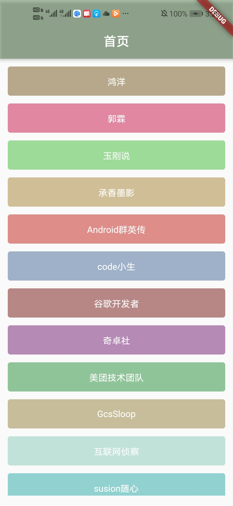

## 一、quick_flutter 简介
 quick_fluuter 意在快速构建一个简单flutter app,结合Provider实现flutter的MVVM模式。

 #### 基于MVVM架构封装Flutter基础库，包含：  
1、基于Dio进行二次封装,提供默认配置以及局部配置。结合baseview的缺省页面进行页面交互。
2、提供常用工具类。SpUtil 键值对的存储。LogUtil 打印日志。ImageUtil 获取图片的宽高。

#### 集成一下三方库：
1、[dio](https://pub.dev/packages/dio)：网络请求。  
2、[fluttertoast](https://pub.dev/packages/fluttertoast)：toast工具。  
3、[provider](https://pub.dev/packages/provider)：状态管理库，使用Provider来实现MVVM模式。

4、[shared_preferences](https://pub.dev/packages/shared_preferences)：sp工具类。 

5、[connectivity](https://pub.dev/packages/connectivity)：网络连接状态工具。

6、[path_provider](https://pub.dev/packages/path_provider)：存储路径获取。

 

example 截图:

